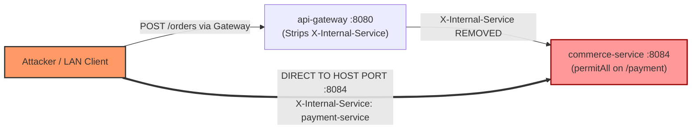

# 15 - Trust Boundaries & Perimeter Security Audit

**Audit Date:** September 2026
**Auditor:** Antigravity Autonomous Senior Software-Engineering Agent
**Standard of Evidence:** Strict code citations (`Repository`, `File`, `Symbol`, `Line`)

---

## 1. Executive Summary

A robust microservice architecture enforces defense-in-depth across two distinct security tiers:
1. **Perimeter Boundary:** Public ingress where client requests undergo authentication, header sanitization, and rate-limiting.
2. **Internal Service Boundary:** Mutual trust between services, protected via network isolation, internal signatures (HMAC), or mutual TLS (mTLS).

In the MaSoVa ecosystem, the internal trust boundary is fatally compromised by an anti-pattern: downstream microservices accept unauthenticated internal assertion headers (`X-Internal-Service`) without cryptographic signatures, while Docker host port exposures allow callers to bypass the perimeter Gateway completely.

---

## 2. In-Depth Trust Boundary Analysis

### 2.1 The Gateway Sanitization Illusion
* **Component:** `SVamseekar/masova-platform` (`api-gateway`)
* **File:** `api-gateway/src/main/java/com/MaSoVa/gateway/config/GatewayConfig.java:L299`
* **Mechanism:**
  * Spring Cloud Gateway removes internal headers from incoming public requests:
    ```java
    .filters(f -> f.removeRequestHeader("X-Internal-Service"))
    ```
  * Architectural intent: Prevent internet attackers from forging internal service identity.

### 2.2 The Host Port Exposure Hole
* **Component:** `SVamseekar/masova-platform` (`docker-compose.yml`)
* **Lines:** 23–160
* **Configuration Citation:**
  ```yaml
  commerce-service:
    ports:
      - "8084:8084"
  core-service:
    ports:
      - "8085:8085"
  logistics-service:
    ports:
      - "8086:8086"
  payment-service:
    ports:
      - "8089:8089"
  intel-service:
    ports:
      - "8087:8087"
  ```
* **Vulnerability Analysis:**
  * Every backend service binds its internal container port to all host interfaces (`0.0.0.0`).
  * On the Dell deployment server (`192.168.50.88`), port `8084` is reachable by any host on the subnet.
  * An attacker on the local network (or a malware process running on a workstation or compromised container) connects directly to `http://192.168.50.88:8084`, bypassing `api-gateway:8080` entirely.
  * The Gateway's `removeRequestHeader("X-Internal-Service")` filter is never executed.

---

### 2.3 The Unsigned Internal Header Exploit
* **Component:** `SVamseekar/masova-platform` (`commerce-service`)
* **File:** `commerce-service/src/main/java/com/MaSoVa/commerce/config/SecurityConfig.java:L51`
* **File:** `commerce-service/src/main/java/com/MaSoVa/commerce/order/controller/OrderController.java:L383-394`
* **Exploitation Chain:**
  1. `SecurityConfig.java:L51` lists `/api/orders/*/payment` as a public endpoint (`permitAll()`).
  2. Spring Security allows the HTTP PATCH request into `OrderController.updatePaymentStatus` with zero credentials.
  3. `OrderController.java` checks:
     ```java
     String internalCaller = httpRequest.getHeader("X-Internal-Service");
     if (internalCaller == null || internalCaller.isBlank()) {
         // Requires ROLE_MANAGER / ROLE_STAFF
     }
     ```
  4. The attacker provides `X-Internal-Service: payment-service`.
  5. The method skips role verification and executes `orderService.updatePaymentStatus(...)`, marking the order as `PAID`.
* **Zero Trust Invariant Violated:** Service assertions must never be accepted over unauthenticated HTTP without mutual TLS or HMAC signature verification.

---

## 3. Trust Boundary Summary



* **Conclusion:** The ecosystem possesses zero perimeter defense against local network actors or container-escape scenarios. An unauthenticated request can mark any order paid and initiate food preparation.

