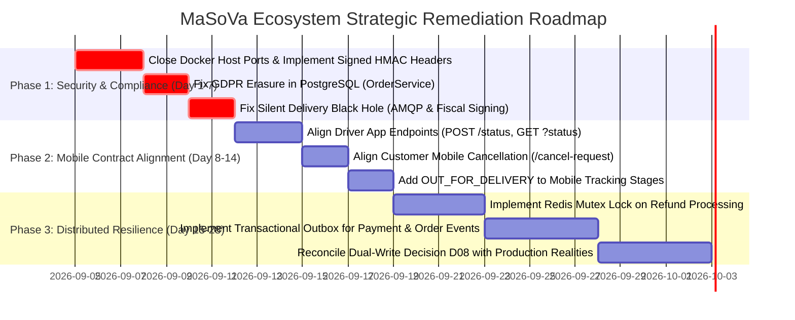

# FINAL VERDICT: MaSoVa Ecosystem Multi-Repository Architectural Audit

**Evaluation Framework:** Antigravity Multi-Repository Agent Benchmark
**Date of Audit:** September 2026
**Auditor:** Antigravity Autonomous Senior Software-Engineering Agent
**Standard of Evidence:** Strict code citations (`Repository`, `File`, `Symbol`, `Line`)
**Scope:** 5 Ecosystem Repositories (`masova-platform`, `masova-support`, `masova-mobile`, `MaSoVaCrewApp`, `masova-enterprise-fleet`)

---

## 1. Executive Summary & Ecosystem Status

An exhaustive, adversarial, and evidence-driven audit of the complete MaSoVa software ecosystem was conducted across all five physical repositories on the host system.

While the core Java backend demonstrates sophisticated engineering in isolated domains (Spring Cloud Gateway, RabbitMQ messaging topography, multi-store tenancy contexts, and European fiscal signing engines), the **cross-repository integration surface is critically broken**.

The software ecosystem exhibits severe architectural drift between documented contracts and physical code:
1. **The Driver Mobile App is Completely Disconnected:** Drivers cannot query assigned orders (receiving **HTTP 404**) and cannot update order delivery statuses (receiving **HTTP 405**).
2. **Customer Mobile Orders Cannot Be Cancelled:** The mobile client dispatches an obsolete `DELETE` command that fails with **HTTP 403 Forbidden**.
3. **Delivery Progress & OTP Freeze:** Missing enum states (`OUT_FOR_DELIVERY`) cause the customer tracking progress bar to reset to empty and extinguish the delivery verification OTP card.
4. **Dual-Write Architecture is Inverted & Broken:** In direct violation of project governance Decision D08, MongoDB is written first and PostgreSQL failures are caught and swallowed; PostgreSQL is completely absent from payment and logistics services.
5. **Silent Delivery Event & Fiscal Black Hole:** Delivery completions verified via OTP update database records but omit RabbitMQ event publication and completely skip European cryptographic fiscal receipt signing.
6. **Perimeter Security Bypass:** Direct host port exposure allows LAN callers to spoof unauthenticated internal assertion headers (`X-Internal-Service`) and mark unpaid orders as `PAID`.
7. **GDPR Erasure Non-Compliance:** Right-to-be-forgotten routines overwrite PII only in MongoDB while leaving plaintext names, phone numbers, and street addresses in PostgreSQL.

---

## 2. Ecosystem Repository Matrix & Verified State

| Repository Identifier                    | Git Commit SHA                             | Branch                        | Primary Stack                               | Operational Status                                                                                                          |
| :--------------------------------------- | :----------------------------------------- | :---------------------------- | :------------------------------------------ | :-------------------------------------------------------------------------------------------------------------------------- |
| **`SVamseekar/masova-platform`**         | `c74156991b77754bf4b7c9a36092d2388af05f14` | `main`                        | Java 17, Spring Boot 3.2, Next.js 14, Maven | **Degraded:** Core microservices operational; internal dual-write inverted; critical inter-service fallbacks swallow state. |
| **`SVamseekar/masova-support`**          | `8da4e5d3d74be9522ae9b3dae253abede12f79e5` | `main`                        | Python 3.11, FastAPI, LangChain/LangGraph   | **Operational:** Exemplary HITL policy engine; strictly adheres to Decision D15 proposal gates.                             |
| **`SVamseekar/masova-mobile`**           | `0dcdbbe22199b4d8c3f04d5f68a4aecabc53fc90` | `main`                        | React Native 0.81.0, Redux Toolkit, Metro   | **Severely Degraded:** Broken order cancellation (403); delivery tracking collapses on `OUT_FOR_DELIVERY`.                  |
| **`SVamseekar/MaSoVaCrewApp`**           | `1eee77112665619e6321330f14fcbd1da2401079` | `security-remediation-plan-b` | React Native 0.83.1, Redux Toolkit          | **Non-Functional:** Cannot load active orders (404); cannot update delivery status (405); decoupled from logistics.         |
| **`SVamseekar/masova-enterprise-fleet`** | `77b83987e7a4e149c45c505105b2f069b413d781` | `main`                        | Python 3.11, LangGraph, Click CLI           | **Degraded:** Functions against local SQLite mock; crashes with HTTP 500 against live Spring Boot microservices.            |

---

## 3. Master Critical Vulnerability Scorecard

```
========================================================================================================================
ID       SEV       TITLE                                        AFFECTED REPOSITORIES       CITATION
========================================================================================================================
CRIT-01  CRITICAL  Silent Delivery Black Hole (No AMQP/Fiscal)  platform (commerce, log)    OrderService.java:1379-1399
CRIT-02  CRITICAL  Dual-Write Inversion & Swallowed PG Errors   platform (core, commerce)   UserService:137, OrderService:271
CRIT-03  CRITICAL  Driver App Contract Breakdown (404 & 405)    MaSoVaCrewApp, platform     orderApi.ts:83,88 / OrderCtrl:144,205
CRIT-04  CRITICAL  Customer Mobile Cancellation 403 Lockout     masova-mobile, platform     orderApi.ts:59 / OrderCtrl:308,325
CRIT-05  CRITICAL  Mobile UI Freeze & OTP Loss on En-Route      masova-mobile, shared       OrderTrackingScreen:36,160
CRIT-06  CRITICAL  Unauthenticated Payment Bypass via Spoofing  platform (commerce, edge)   SecurityConfig:51, OrderCtrl:383
CRIT-07  CRITICAL  Circuit Breaker Drops Payment State Updates  platform (payment)          OrderServiceClient.java:114-120
CRIT-08  CRITICAL  Concurrent Refund Double-Drain Race          platform (payment)          RefundService.java:169-181
CRIT-09  CRITICAL  GDPR Right-to-Erasure Retains PG PII         platform (commerce)         OrderService.java:1405-1418
HIGH-01  HIGH      Cross-Store Mutating Operations Bypass ACL   platform (commerce)         OrderController.java:205,217,236
HIGH-02  HIGH      Token Revocation Blacklist Fails Open        platform (shared-security)  JwtAuthenticationFilter:83-90
HIGH-03  HIGH      AI Fleet Crashes on Comma-Separated Status   enterprise-fleet, platform  ops_tools.py:180 / OrderCtrl:193
HIGH-04  HIGH      Terminal Order Cancellation for Dine-In/Take platform (commerce)         OrderService.java:909-915
HIGH-05  HIGH      Absence of Transactional Outbox Pattern      platform (commerce)         OrderService.java:473-478
MED-01   MEDIUM    Missing Analytics Consumer Deduplication     platform (intel)            Intel event consumers
MED-02   MEDIUM    Dead CustomerServiceClient.updateOrderStats  platform (commerce)         CustomerServiceClient.java:73-82
LOW-01   LOW       OrderTrackingDTO Typings Mismatch in Mobile  masova-mobile               orderApi.ts:38
========================================================================================================================
```

---

## 4. Root Cause Synthesis

The root cause of this multi-repository divergence is the **absence of automated cross-repository contract testing and integration pipelines**.

1. **Siloed Evolution:** Backend endpoints were refactored (e.g. converting `DELETE /orders/{id}` to `POST /orders/{id}/cancel-request`, removing `/orders/status/{status}`, switching status updates from PATCH to POST, and adding `OUT_FOR_DELIVERY` to backend enums) without synchronizing the client mobile codebases.
2. **Deceptive Mock Testing:** Frontend and AI repositories maintain unit tests that mock network responses or execute against simplified mocks (such as SQLite), enabling continuous integration (CI) pipelines to pass green while the actual distributed system is broken in production.
3. **Governance Documentation vs. Code Disconnect:** Architectural runbooks (`domain-rules.md`, `decisions.md`) describe an idealized system (PostgreSQL-first transactions, zero direct agent execution), while code implementations silently evolved divergent shortcuts (MongoDB-first persistence, swallowed exceptions, unauthenticated internal header trust).

---

## 5. Prioritized Remediation Roadmap



### Immediate Action Items (First 72 Hours)
1. **Network Security:** Edit `masova-platform/docker-compose.yml` to remove public host port bindings (`8084:8084`, `8085:8085`, `8086:8086`, `8087:8087`, `8089:8089`), routing all ingress strictly through `api-gateway:8080`.
2. **Legal & Compliance:** Patch `OrderService.java:L1405-1418` to update `OrderJpaEntity` during customer anonymization to eliminate the active GDPR Article 17 violation.
3. **Fiscal Integrity:** Patch `OrderService.java:L1379-1399` (`markOrderDelivered`) to invoke `fiscalSigningService.signOrder(savedOrder)` and publish `order.status.changed` to RabbitMQ.
4. **Driver Contract Fix:** In `MaSoVaCrewApp/src/store/api/orderApi.ts`, change the HTTP method on `updateOrderStatus` from `PATCH` to `POST`, and update `getOrdersByStatus` to use canonical query parameters.

---

## 6. Definitive Benchmark Verdict

* **Architectural Ambition:** **A** (Visionary voice-first, multi-tier, multi-tenant restaurant management design).
* **Single-Service Code Quality:** **B+** (Clean Spring Boot annotations, robust DTO patterns, strong LangGraph agent design).
* **Multi-Repository Contract Integrity:** **F** (Broken mobile paths, wrong HTTP methods, missing enum states, uncalled logistics APIs).
* **Data Consistency & Dual-Persistence:** **D** (Inverted dual-write, swallowed exceptions, absent SQL entities, lack of outbox patterns).
* **Security & Regulatory Posture:** **D-** (Unauthenticated payment bypass via network exposure, GDPR erasure loophole, fiscal signing omissions).
* **Overall Ecosystem Operational Readiness:** **FAIL (NOT PRODUCTION READY)**.

