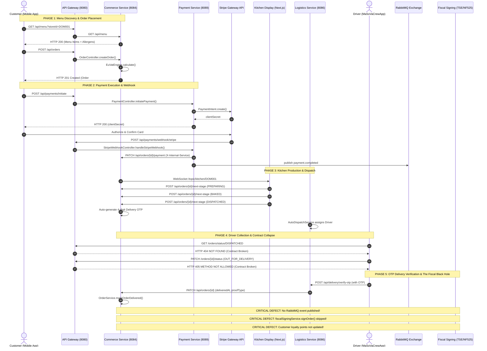

# 02 — Test 2: One Customer Order Trace

**Benchmark:** MSB-002
**Title:** European Single-Restaurant Operational Readiness
**Perspective:** End-to-End Lifecycle Trace of a Single Customer Delivery Order
**Standard of Evidence:** Strict source-code citations (`Repository`, `File`, `Symbol`, `Line`)
**Status Tags:** `[VERIFIED FROM SOURCE]`, `[STRONGLY INFERRED]`, `[REQUIRES RUNTIME VALIDATION]`, `[REQUIRES LEGAL/TAX REVIEW]`

---

## 1. Journey Overview & Sequence Flow

This audit traces a single delivery order in the European Union from catalog browsing through delivery confirmation, fiscal signing, and post-order analytics.



---

## 2. Transition-by-Transition Detailed Trace

### Transition 1: Browsing the Menu
* **Initiating Application:** Customer Mobile App (`masova-mobile`).
* **API Route:** `GET /api/menu?storeId={storeId}&available=true`.
* **API Gateway Route:** `api-gateway/.../GatewayConfig.java:L214` (route `commerce_menu_public`).
* **Controller:** `commerce-service/.../MenuController.java:L55` (`getMenuItems`).
* **Service:** `commerce-service/.../MenuService.java:L65` (`getMenuItems`).
* **Database Access:** MongoDB `menu_items` collection.
* **Cache:** `@Cacheable(value = "menuItems", key = "#storeId")` in `MenuService.java:L64`.
* **Failure Handling:** If Redis is down, Spring Cache throws `RedisConnectionFailureException` without fallback, returning **HTTP 500**.
* **Idempotency:** Pure read; naturally idempotent.
* **User-Visible Consequence:** Displays category tabs, item photos, and allergen chips (`ItemDetailScreen.tsx`).

---

### Transition 2: Placing the Order
* **Initiating Application:** Customer Mobile App (`masova-mobile/src/screens/cart/CheckoutScreen.tsx`).
* **API Route:** `POST /api/orders`.
* **API Gateway Route:** `api-gateway/.../GatewayConfig.java:L286` (route `commerce_orders_write`).
* **Controller:** `commerce-service/.../OrderController.java:L111` (`createOrder`).
* **Service:** `commerce-service/.../OrderService.java:L132` (`createOrder`).
* **Inter-Service Feign Calls:**
  1. `storeServiceClient.getStore(request.getStoreId())` (`L176`): Fetches store identity and country code.
  2. `deliveryServiceClient.calculateDeliveryFee(...)` (`L151`): Computes zone delivery fee.
* **Tax/VAT Engine:**
  * `commerce-service/.../EuVatEngine.java:L36-60`:
    * Evaluates context (`DELIVERY`) and items.
    * Inverts price: treats `item.getPrice()` as NET and calculates VAT on top.
    * Untaxed delivery fee: delivery fee is appended directly to total without VAT.
    * Fallback vulnerability: If `storeServiceClient` times out, defaults to Indian Maharashtra GST (`L198-204`).
* **Database Mutations:**
  1. MongoDB: `orderRepository.save(order)` (`OrderService.java:L271`). Status set to `RECEIVED`.
  2. PostgreSQL Dual-Write: `orderJpaRepository.save(jpaEntity)` (`L302`) in `try/catch`. If PostgreSQL fails, error is logged and swallowed.
* **Event Publication:**
  * Exchange: `order.exchange`, Routing Key: `order.created`.
  * Publisher: `OrderEventPublisher.java:L309`.
  * Failure Handling: Swallowed in `catch` block (`L310-312`).
* **WebSocket Mutation:** `webSocketController.sendKitchenQueueUpdate(storeId, savedOrder)` (`L326`).
* **Idempotency:** Non-idempotent. Retrying creates a duplicate order with a new random number.
* **User-Visible Consequence:** Order created; client receives `orderId` and order number `ORD...`.

---

### Transition 3: Initiating Payment
* **Initiating Application:** Customer Mobile App (`masova-mobile`).
* **API Route:** `POST /api/payments/initiate`.
* **API Gateway Route:** `api-gateway/.../GatewayConfig.java:L330` (route `payment_initiate`).
* **Controller:** `payment-service/.../PaymentController.java:L58` (`initiatePayment`).
* **Service:** `payment-service/.../PaymentService.java:L80` (`initiatePayment`).
* **External Gateway:** `StripeGateway.java:L45-80` calls Stripe API `PaymentIntent.create()`.
* **Database Mutation:** MongoDB `transactions` collection (`PaymentService.java:L137`). Status: `INITIATED`. PII encrypted via AES (`PiiEncryptionService.java`).
* **PostgreSQL Mutation:** **ZERO**. `payment-service` has no JPA entities or PostgreSQL dual-write.
* **Failure Handling:** Throws `RuntimeException`, returning HTTP 500 to client.
* **Idempotency:** **NON-IDEMPOTENT**. Multiple calls create multiple Stripe PaymentIntents.
* **User-Visible Consequence:** Client receives `stripeClientSecret` and mounts Stripe Payment Sheet.

---

### Transition 4: Payment Confirmation (Stripe Webhook)
* **Initiating Application:** Stripe Infrastructure (`api.stripe.com`).
* **API Route:** `POST /api/payments/webhook/stripe`.
* **API Gateway Route:** Public gateway route (bypasses JWT).
* **Controller:** `payment-service/.../StripeWebhookController.java:L39` (`handleStripeWebhook`).
* **Signature Verification:** `StripeGateway.parseWebhook(rawPayload, stripeSignature)` (`L46`).
* **Service:** `payment-service/.../PaymentService.java:L314` (`handleStripeWebhookEvent`).
* **Database Mutation:** MongoDB `transactions` collection updated to `status: SUCCESS` (`L351`).
* **Inter-Service REST Call:**
  * `OrderServiceClient.java:L45`: Calls `PATCH /api/orders/{orderId}/payment` on `commerce-service` with header `X-Internal-Service: payment-service`.
  * **FATAL RESILIENCE FLAW:** Wrapped in `@CircuitBreaker(fallbackMethod = "updateOrderPaymentStatusFallback")`. If `commerce-service` fails, the fallback **swallows the error** (`L114-120`). Webhook returns HTTP 200 to Stripe, but order remains unpaid in `commerce-service`.
* **Event Publication:** `paymentEventPublisher.publishPaymentCompleted(...)` (`L369`) published to `payment.exchange`.
* **User-Visible Consequence:** Payment marked successful; receipt email sent.

---

### Transition 5: Kitchen Preparation & Bump
* **Initiating Application:** Kitchen Display System (Next.js staff web portal: `frontend/src/pages/kitchen/KitchenDisplayPage.tsx`).
* **Trigger:** STOMP WebSocket message received on `/topic/kitchen/{storeId}`.
* **API Routes:** `POST /api/orders/{id}/next-stage`.
* **Controller:** `commerce-service/.../OrderController.java:L217` (`nextStage`).
* **Service:** `commerce-service/.../OrderService.java:L513` (`moveOrderToNextStage`).
* **State Progression:**
  * Bump 1: `RECEIVED` → `PREPARING` (`prepStartedAt` timestamp set).
  * Bump 2: `PREPARING` → `BAKED` (`bakedAt` timestamp set).
* **Database Mutation:** MongoDB `orders` updated; PostgreSQL `commerce_schema.orders` synced.
* **Concurrency Handling:** Optimistic locking via `@Version` in MongoDB `Order.java:L33`. If two kitchen workers tap simultaneously, one throws unhandled `OptimisticLockingFailureException` (HTTP 500).
* **User-Visible Consequence:** Order card advances on kitchen screen; customer mobile tracking updates stage.

---

### Transition 6: Ready & Auto-Dispatch
* **Initiating Application:** Kitchen Staff / Automated Stage Transition.
* **API Route:** `POST /api/orders/{id}/next-stage`.
* **Service:** `commerce-service/.../OrderService.java:L539-546`.
* **OTP Generation:** When order reaches `DISPATCHED`, `generateDeliveryOtpCode()` generates a 4-digit numeric code (`order.setDeliveryOtp(otp)`), valid for 15 minutes.
* **Logistics Dispatch:** `logistics-service/.../AutoDispatchService.java` selects the optimal driver based on proximity and workload, assigning `driverId` to the delivery.
* **User-Visible Consequence:** Customer app tracking screen displays: "Driver assigned — share your 4-digit PIN with the driver."

---

### Transition 7: Driver Order Fetching & En-Route Transition
* **Initiating Application:** Driver Mobile App (`MaSoVaCrewApp`).
* **Intended Action:** Driver logs in, views assigned orders, accepts dispatch, and marks order `OUT_FOR_DELIVERY`.
* **ACTUAL TECHNICAL REALITY: COMPLETE BREAKDOWN**
  1. **Fetching Orders:** `MaSoVaCrewApp/src/store/api/orderApi.ts:L83` invokes:
     `GET /orders/status/DISPATCHED`
     * **Result:** **HTTP 404 Not Found**. The endpoint was deleted from `OrderController.java`.
  2. **Updating Status:** `MaSoVaCrewApp/src/store/api/orderApi.ts:L88` invokes:
     `PATCH /orders/{orderId}/status` with `{ "status": "OUT_FOR_DELIVERY" }`
     * **Result:** **HTTP 405 Method Not Allowed**. `OrderController.java:L205` strictly requires HTTP `POST`.
  3. **Customer UI Collapse:** Even if patched manually, `masova-mobile/.../OrderTrackingScreen.tsx:L36,L160` does not include `OUT_FOR_DELIVERY` in its tracking stage array. The customer progress bar resets to 0% and the OTP display card disappears from view.

---

### Transition 8: Customer Delivery & Proof of Delivery (OTP)
* **Initiating Application:** Driver Mobile App / Staff POS Override.
* **API Route:** `POST /api/delivery/verify-otp`.
* **Controller:** `logistics-service/.../DeliveryController.java`.
* **Service:** `logistics-service/.../ProofOfDeliveryService.java:L71-120` (`verifyDeliveryOtp`).
* **Verification:** Matches client-submitted 4-digit OTP against `order.get("deliveryOtp")`. Locked out after 5 failed attempts (`MAX_OTP_VERIFY_ATTEMPTS`).
* **Downstream Call:** `orderServiceClient.markOrderDelivered(orderId, deliveredAt, "OTP")` calls `commerce-service:8084/api/orders/{id}` with `deliveredAt` and `proofType`.
* **Service Implementation:** `commerce-service/.../OrderService.java:L1379-1399` (`markOrderDelivered`):
  ```java
  order.setStatus(OrderStatus.DELIVERED);
  order.setDeliveredAt(deliveredAt);
  order.setCompletedAt(deliveredAt);
  order.setDeliveryProofType(proofType);
  Order savedOrder = orderRepository.save(order);
  syncToPostgres(savedOrder);
  customerNotificationService.sendOrderStatusNotification(savedOrder, OrderStatus.DELIVERED);
  webSocketController.sendKitchenQueueUpdate(savedOrder.getStoreId(), savedOrder);
  return savedOrder;
  ```
* **THE SILENT DELIVERY BLACK HOLE:**
  1. `OrderService.java:L1379-1399` **omits `orderEventPublisher.publishOrderStatusChanged()`**. No message is sent to RabbitMQ.
  2. `OrderService.java:L1379-1399` **omits `customerServiceClient.updateOrderStats()`**. Customer loyalty points are never awarded.
  3. `OrderService.java:L1379-1399` **omits `fiscalSigningService.signOrder()`**. Cryptographic fiscal signing is completely bypassed.

---

### Transition 9: Fiscal Record Production
* **Expected Action:** Generation of a cryptographically signed tax ledger entry.
* **ACTUAL TECHNICAL REALITY:**
  1. For delivery orders completed via OTP, `fiscalSigningService.signOrder()` is never invoked (see Transition 8).
  2. For dine-in orders completed via `updateOrderStatus()` (`OrderService.java:L502-504`), `fiscalSigningService.signOrder()` is invoked asynchronously.
  3. However, `GermanyTseFiscalSigner.java:L27-32` and `FranceNf525FiscalSigner.java:L26-32` are **pure stubs**:
     ```java
     String tseTransactionId = "TSE-DE-" + UUID.randomUUID().toString().substring(0, 8).toUpperCase();
     String signatureValue = "STUB-TSE-SIG-" + order.getId();
     ```
  4. No hardware security module or certified cloud service is contacted. The signature is fictitious.

---

### Transition 10: Receipt & Accounting Record
* **Initiating Application:** Staff Web App (`frontend/src/components/ReceiptGenerator.tsx`).
* **Execution:** Renders an HTML modal in the browser.
* **Content:** Uses client-side state. Defaults to hardcoded Bangalore, India store address and `Tax (5% GST)` unless overridden.
* **Output:** User can print via browser `window.print()` or download raw HTML. No signed PDF, no fiscal QR code, and no compliance certificate.

---

### Transition 11: Loyalty, Analytics, & Support State Updates
* **Loyalty Update:** **LOST**. Omitted in `markOrderDelivered` (`L1379-1399`). Customer loyalty balance remains unchanged.
* **Analytics Event Stream:** **LOST**. Because RabbitMQ publication was omitted in `markOrderDelivered`, `intelligence-service` event consumers never receive notification of order delivery. Real-time delivery revenue reports register €0.
* **Customer Support Agent State:** The support agent (`masova-support/.../backend_tools.py:L100`) queries `GET /api/orders/{id}`. Because MongoDB was updated, the agent can see status `DELIVERED`, but cannot assist with disputes because the fiscal and event history is disconnected.

---

## 3. Order Trace Audit Summary Matrix

| Transition           | Action              | Component / Class            | Verified Result         | User Consequence             |
| :------------------- | :------------------ | :--------------------------- | :---------------------- | :--------------------------- |
| **T1: Browse**       | Fetch catalog       | `MenuController:L55`         | ✅ OK (Cache-sensitive)  | Menu displayed               |
| **T2: Place Order**  | Create order & tax  | `OrderService:L132`          | ❌ VAT Net-Inverted      | Customer overcharged VAT     |
| **T3: Pay**          | Stripe intent       | `PaymentService:L80`         | ⚠️ Non-idempotent        | Risk of duplicate intent     |
| **T4: Webhook**      | Confirm payment     | `OrderServiceClient:L114`    | ❌ Swallowed on fallback | Paid order can remain unpaid |
| **T5: Kitchen Prep** | Advance stage       | `OrderService:L513`          | ⚠️ Optimistic lock race  | Concurrent tap throws 500    |
| **T6: Dispatch**     | Generate OTP        | `OrderService:L539`          | ✅ OTP generated         | Customer receives PIN        |
| **T7: Driver Fetch** | Query & en-route    | `MaSoVaCrewApp:L83,L88`      | ❌ HTTP 404 & 405        | Driver app completely broken |
| **T8: Deliver**      | OTP verification    | `OrderService:L1379`         | ❌ Omitted AMQP & fiscal | Delivery completed in dark   |
| **T9: Fiscal Sign**  | Legal signature     | `GermanyTseFiscalSigner:L27` | ❌ Mock STUB string      | Tax evasion liability        |
| **T10: Receipt**     | Generate invoice    | `ReceiptGenerator:L47`       | ❌ Raw browser HTML      | Non-compliant tax receipt    |
| **T11: Post-Order**  | Loyalty & analytics | `OrderService:L1379`         | ❌ Skipped in code       | Zero loyalty, zero analytics |

**Audit Conclusion:** A complete customer order journey **cannot successfully execute in production**. Even if staff manually work around the driver app breakdown, the order finishes in an audit black hole without legal fiscal signing, loyalty accumulation, or analytics recording.

